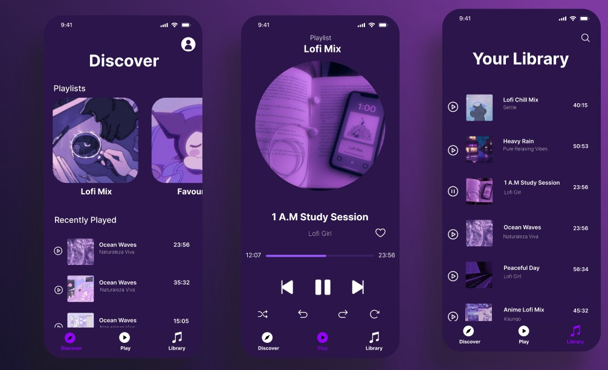

# 🌙 Lofi Vibes

**Relax. Focus. Chill.**  

**Lofi Vibes** is a cozy lofi music app for **Android**, built with **Expo Go**. Immerse yourself in soothing beats, ambient sounds, and piano melodies your perfect companion for studying, relaxing, or winding down.

---

## ✨ Features

- **Personal Accounts** - sign up and log in with Firebase Authentication  
- **Custom Avatars** - pick your avatar and make your profile yours  
- **Built-in Playlists:**  
  - **Lofi Mix** - curated lofi tracks  
  - **Favorites** - save your favorite songs  
  - **Nature Sounds** - calming environmental sounds  
  - **Piano Vibes** - soft piano melodies  
- **Personalised Listening Experience** - everything saved per user  

---

## 🎨 App Design

- **Home Screen**  
- **Player Screen**  
- **Library / Playlists**  
- **Profile / Avatar Selection**  
## UI Design

---

## 🚀 Getting Started

This project was built with React Native using Expo. To run the app, you’ll need Node.js and Expo Go installed.

### 1. Install dependencies

`npm install`

2. Start the app

npx expo start
Open on Android using:

Expo Go

Android emulator

Start building by editing files in the app directory. This project uses file-based routing.

🔄 Reset the Project
To start fresh:

`npm run reset-project`

Moves starter code to app-example and creates a blank app directory to develop your own version.

📚 Learn More
Expo Documentation

Learn Expo Tutorial

Firebase Authentication Docs

